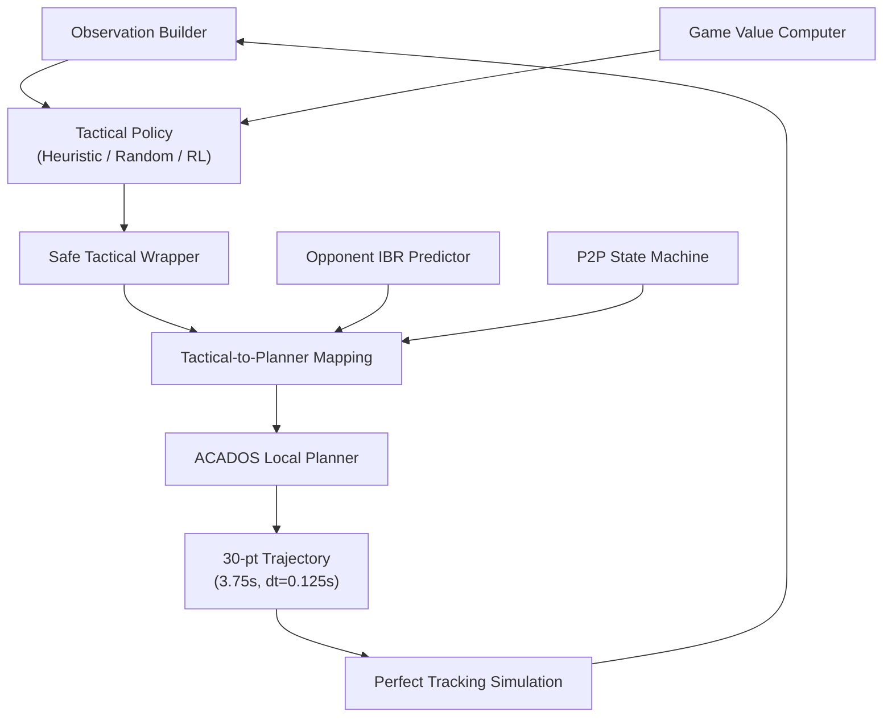

# Tactical RL + ACADOS Planning System — Walkthrough

## What Was Built

A complete two-layer **game-theoretic tactical RL + ACADOS local planning** system for autonomous racing on YAS North, implemented as 22 new files in `tactical_acados/`.

## Architecture



## Files Created (22 total)

| Phase | File | Purpose |
|-------|------|---------|
| Core | [config.py](file:///home/uav/11gsytset/0A_LYX_CODE/SAMPLE_local_paper/sampling_based_3D_local_planning/tactical_acados/config.py) | Central configuration (all parameters) |
| Core | [tactical_action.py](file:///home/uav/11gsytset/0A_LYX_CODE/SAMPLE_local_paper/sampling_based_3D_local_planning/tactical_acados/tactical_action.py) | Hybrid action space (6 discrete × continuous × P2P) |
| P1 | [acados_planner.py](file:///home/uav/11gsytset/0A_LYX_CODE/SAMPLE_local_paper/sampling_based_3D_local_planning/tactical_acados/acados_planner.py) | ACADOS wrapper with fallback & resampling |
| P1 | [sim_acados_only.py](file:///home/uav/11gsytset/0A_LYX_CODE/SAMPLE_local_paper/sampling_based_3D_local_planning/tactical_acados/sim_acados_only.py) | Phase 1 simulation entry |
| P1 | [p2p.py](file:///home/uav/11gsytset/0A_LYX_CODE/SAMPLE_local_paper/sampling_based_3D_local_planning/tactical_acados/p2p.py) | Push-to-pass state machine (15s, +50hp) |
| P1 | [visualizer_tactical.py](file:///home/uav/11gsytset/0A_LYX_CODE/SAMPLE_local_paper/sampling_based_3D_local_planning/tactical_acados/visualizer_tactical.py) | Track + velocity + lateral + info viz |
| P2 | [observation.py](file:///home/uav/11gsytset/0A_LYX_CODE/SAMPLE_local_paper/sampling_based_3D_local_planning/tactical_acados/observation.py) | 29-dim observation vector |
| P2 | [safe_wrapper.py](file:///home/uav/11gsytset/0A_LYX_CODE/SAMPLE_local_paper/sampling_based_3D_local_planning/tactical_acados/safe_wrapper.py) | Action masking + clipping + fallback |
| P2 | [planner_guidance.py](file:///home/uav/11gsytset/0A_LYX_CODE/SAMPLE_local_paper/sampling_based_3D_local_planning/tactical_acados/planner_guidance.py) | Corridor shaping + speed/safety mapping |
| P2 | [heuristic_policy.py](file:///home/uav/11gsytset/0A_LYX_CODE/SAMPLE_local_paper/sampling_based_3D_local_planning/tactical_acados/policies/heuristic_policy.py) | Rule-based overtake/defend/follow |
| P2 | [random_policy.py](file:///home/uav/11gsytset/0A_LYX_CODE/SAMPLE_local_paper/sampling_based_3D_local_planning/tactical_acados/policies/random_policy.py) | Random sampling from safe set |
| P3 | [opponent.py](file:///home/uav/11gsytset/0A_LYX_CODE/SAMPLE_local_paper/sampling_based_3D_local_planning/tactical_acados/opponent.py) | Opponent vehicle + IBR predictor |
| P3 | [game_value.py](file:///home/uav/11gsytset/0A_LYX_CODE/SAMPLE_local_paper/sampling_based_3D_local_planning/tactical_acados/game_value.py) | 5-term utility + Boltzmann prior |
| P3 | [scenario_a.yml](file:///home/uav/11gsytset/0A_LYX_CODE/SAMPLE_local_paper/sampling_based_3D_local_planning/tactical_acados/scenarios/scenario_a.yml) | 3-car Turns 1-4 |
| P3 | [scenario_b.yml](file:///home/uav/11gsytset/0A_LYX_CODE/SAMPLE_local_paper/sampling_based_3D_local_planning/tactical_acados/scenarios/scenario_b.yml) | 3-car Turns 6-8 |
| P3 | [sim_tactical.py](file:///home/uav/11gsytset/0A_LYX_CODE/SAMPLE_local_paper/sampling_based_3D_local_planning/tactical_acados/sim_tactical.py) | Full 3-car tactical sim |
| P4 | [tactical_env.py](file:///home/uav/11gsytset/0A_LYX_CODE/SAMPLE_local_paper/sampling_based_3D_local_planning/tactical_acados/rl/tactical_env.py) | Gymnasium-compatible env |
| P4 | [reward.py](file:///home/uav/11gsytset/0A_LYX_CODE/SAMPLE_local_paper/sampling_based_3D_local_planning/tactical_acados/rl/reward.py) | 6-component reward function |
| P4 | [hybrid_ppo.py](file:///home/uav/11gsytset/0A_LYX_CODE/SAMPLE_local_paper/sampling_based_3D_local_planning/tactical_acados/rl/hybrid_ppo.py) | Factorized PPO policy network |
| P4 | [theory_prior.py](file:///home/uav/11gsytset/0A_LYX_CODE/SAMPLE_local_paper/sampling_based_3D_local_planning/tactical_acados/rl/theory_prior.py) | Boltzmann prior + regularization losses |
| P4 | [train.py](file:///home/uav/11gsytset/0A_LYX_CODE/SAMPLE_local_paper/sampling_based_3D_local_planning/tactical_acados/rl/train.py) | PPO training loop with theory guidance |

## Verification Results

| Test | Status | Details |
|------|--------|---------|
| Module imports | ✅ | All 22 files import cleanly in `a2rldet` |
| Data structures | ✅ | Action roundtrip, config values, obs dim=29 |
| ACADOS planner | ✅ | **30/30 steps healthy**, solver compiled and ran |
| Trajectory format | ✅ | 30 points, 3.75s horizon, dt=0.125s |

## Usage

```bash
# Phase 1: ACADOS-only test (headless)
conda run -n a2rldet python tactical_acados/sim_acados_only.py --test --steps 200

# Phase 1: ACADOS-only simulation (with visualization)
conda run -n a2rldet python tactical_acados/sim_acados_only.py --visualize --steps 500

# Phase 3: 3-car tactical simulation
conda run -n a2rldet python tactical_acados/sim_tactical.py --scenario scenario_a --max-steps 300
conda run -n a2rldet python tactical_acados/sim_tactical.py --scenario scenario_b --policy random

# Phase 4: RL training
conda run -n a2rldet python tactical_acados/rl/train.py --scenario scenario_a --max-episodes 100
```

## Key Design Decisions

1. **No sampling planner online** — ACADOS OCP is the only online planner
2. **Safety priority** — safe wrapper guarantees planner feasibility even with random RL actions
3. **Corridor shaping** — main opponent avoidance via lateral bound carving, not nonconvex constraints
4. **Factorized hybrid PPO** — Categorical × Gaussian × Bernoulli with safe discrete masking
5. **Theory regularization** — KL to Boltzmann prior + MSE to heuristic targets + game-value auxiliary
